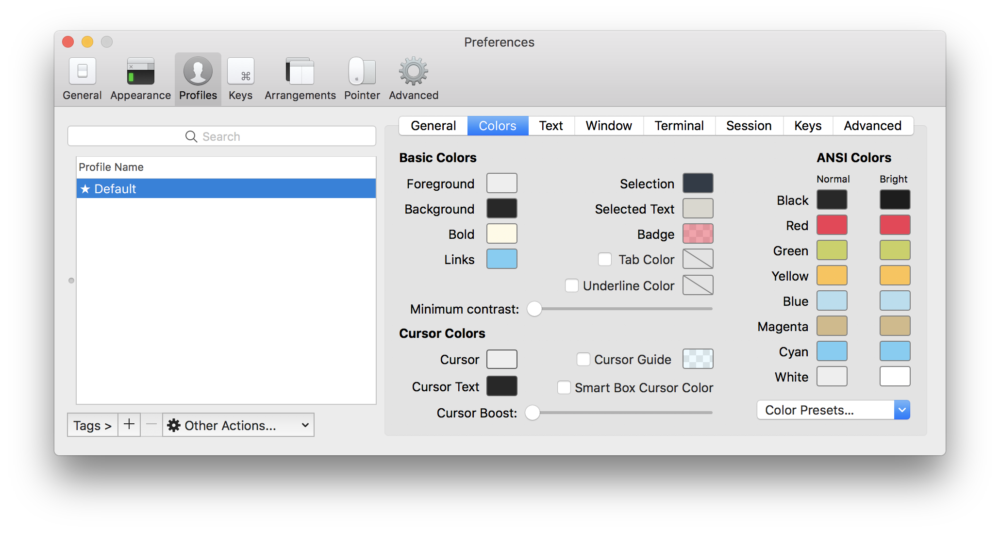
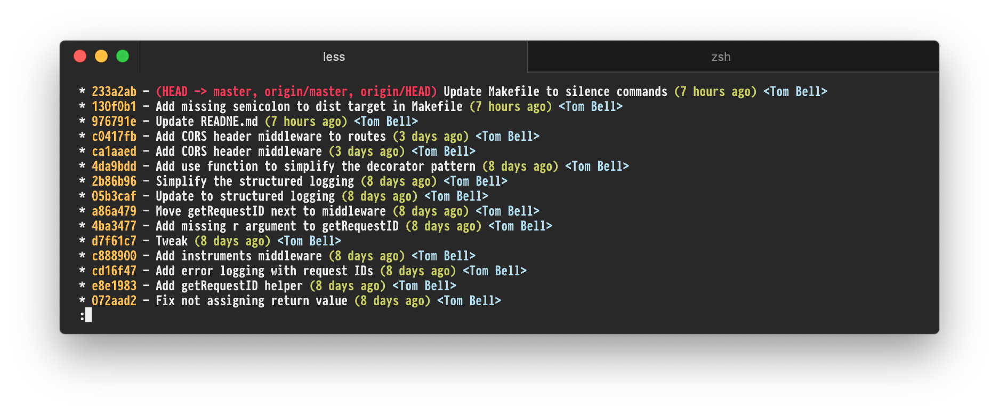
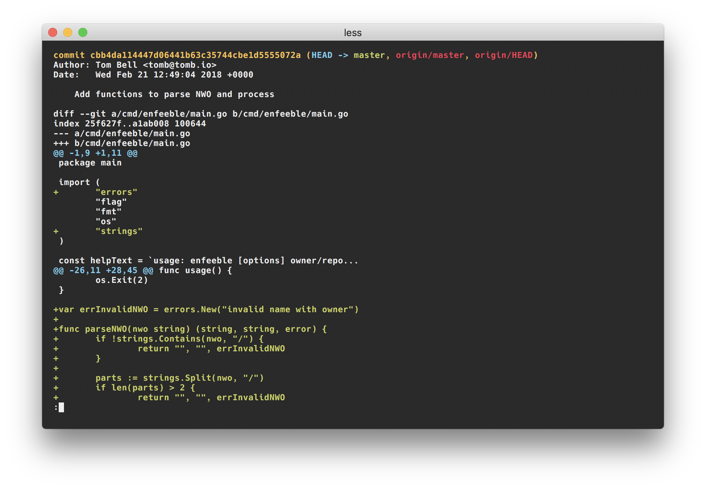

# Tender for iTerm2

An iTerm2 color theme inspired by the [tender.vim](https://github.com/jacoborus/tender.vim) color scheme. Many thanks to [@jacoborus](https://twitter.com/jacoborus).

_Font used in screenshots: bold [Hack](https://sourcefoundry.org/hack/) at size 11_

## Git

**git log**

**git show**

